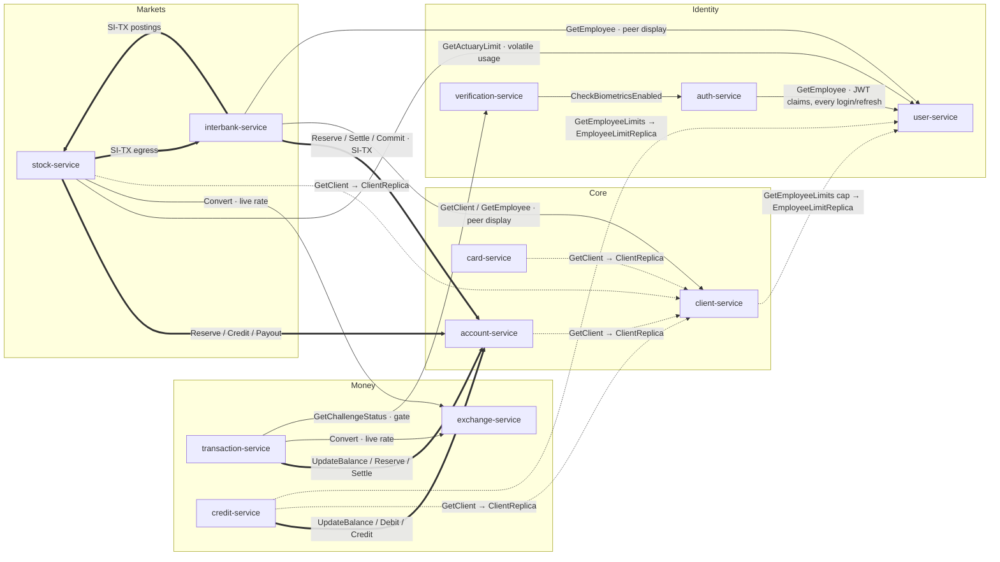

# Microservice Coupling — Synchronous (gRPC) Channels

Generated 2026-06-08, reflecting the state **after** the service-decoupling program (SP-1, SP-2, SP-2b, SP-4, SP-5). It maps every **synchronous gRPC channel between services**. Asynchronous Kafka channels (which now feed the read-model replicas) are not drawn here — this is the sync-coupling view the decoupling work targeted.

The **api-gateway** is the HTTP→gRPC entry point and dials *every* service; it is omitted from the graph below to keep the inter-service coupling legible (it is a hub, not coupling between domain services).

## Channel categories

| Style | Category | Meaning |
|---|---|---|
| `══▶` (thick) | **Money command** | Mutates an account ledger / moves money. Must stay synchronous + saga. Not denormalizable. |
| `──▶` (solid) | **Live read / gate** | Reads volatile or live data (rate, challenge status, actuary usage) or a not-yet-denormalized reference read. |
| `┄┄▶` (dotted) | **Replica-backed read** | Denormalized by the program: served from a local Postgres replica fed by Kafka events; the gRPC call is now a **lazy fallback only** (replica miss / cold start). |
| `══▶ SI-TX` | **Cross-bank (frozen)** | interbank-service ↔ peers/stock for the SI-TX protocol. Protocol-frozen; intentionally not refactored. |

## Graph

## Edge reference (exact)

| From → To | RPC(s) | Category | Status |
|---|---|---|---|
| credit → account | `UpdateBalance`, `DebitBankAccount`, `CreditBankAccount` | money | live (loan disbursement / installments) |
| transaction → account | `UpdateBalance`, `ReserveFunds`, `Release`, `PartialSettle`, `GetAccountByNumber` | money + resolution | live — **SP-3 pending** (resolution+spending read still bundled with the command; see fork note) |
| stock → account | `ReserveFunds`, `CreditAccount`, `PartialSettleReservation`, `Payout` | money | live (trade settlement) |
| auth → user | `GetEmployee` (roles/permissions/name) | live read | **SP-2d pending** — hottest reference read (every login/refresh); security-sensitive to denormalize |
| verification → auth | `CheckBiometricsEnabled` | live read | small flag; not denormalized |
| transaction → exchange | `Convert`, `ConvertViaRSD` | live read | needs live FX rate |
| transaction → verification | `GetChallengeStatus` | gate | live |
| stock → user | `GetActuaryLimit` | live read | **SP-2c forked** — actuary *used/remaining* is volatile, can't replicate |
| stock → exchange | `Convert` | live read | live FX |
| card → client | `GetClient` | replica-backed | **SP-1** — `ClientReplica` in card_db; gRPC fallback only |
| account → client | `GetClient` | replica-backed | **SP-1** — `ClientReplica` in account_db; fallback only |
| credit → client | `GetClient` | replica-backed | **SP-1** — `ClientReplica` in credit_db; fallback only |
| credit → user | `GetEmployeeLimits` | replica-backed | **SP-2** — `EmployeeLimitReplica`; fallback only |
| client → user | `GetEmployeeLimits` (cap) | replica-backed | **SP-2b** — `EmployeeLimitReplica`; fallback only |
| stock → client | `GetClient` | replica-backed | **SP-1** — `ClientReplica`; fallback only |
| interbank → account | `Reserve/Release/Settle/Commit*` | money (SI-TX) | live — frozen protocol |
| stock → interbank | `PostNewTx/Commit/Rollback*` | SI-TX | live — frozen |
| interbank → stock | SI-TX postings | SI-TX | live — frozen |
| interbank → client / user | `GetClient` / `GetEmployee` | live read | display for the frozen cross-bank `/user` endpoint — intentionally left as-is |

## What the decoupling changed

- **`user-service` now dials nobody.** SP-4 removed the `user → client` `SetClientLimits` write (the only client-limit write middle-man); user-service has no outbound gRPC clients.
- **The `client ↔ user` cycle is gone.** SP-4 removed the write; SP-2b made the `client → user` cap read replica-backed.
- **Six former hot/reference reads are now replica-backed** (lazy fallback only): `card/account/credit/stock → client` (ClientReplica) and `credit/client → user` (EmployeeLimitReplica). The gRPC addresses remain wired purely as the cold-start/miss fallback.
- **Still live (by design or pending a decision):** money commands (saga); `transaction → exchange/verification`; `auth → user` (SP-2d, security-sensitive); `stock → user` actuary (SP-2c, volatile data); `transaction → account` resolution (SP-3, money-path fork); and all interbank SI-TX (frozen).

> To regenerate the per-service **DB ER diagrams**: `python3 docs/db/generate_diagrams.py` (outputs `docs/db/<service>_db.png`; auto-discovers tables from each service's GORM models).
